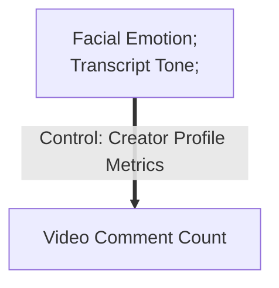
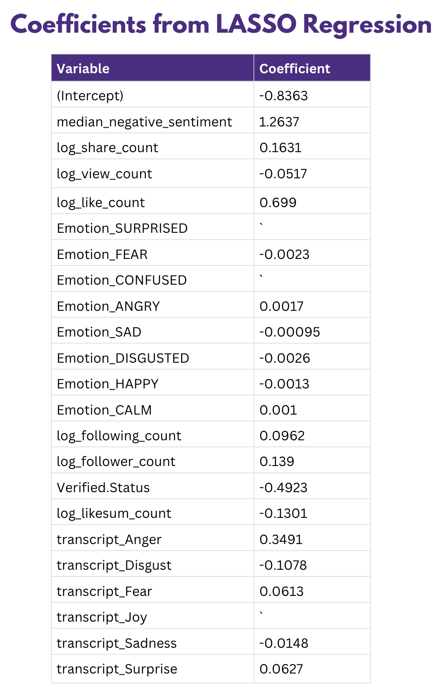
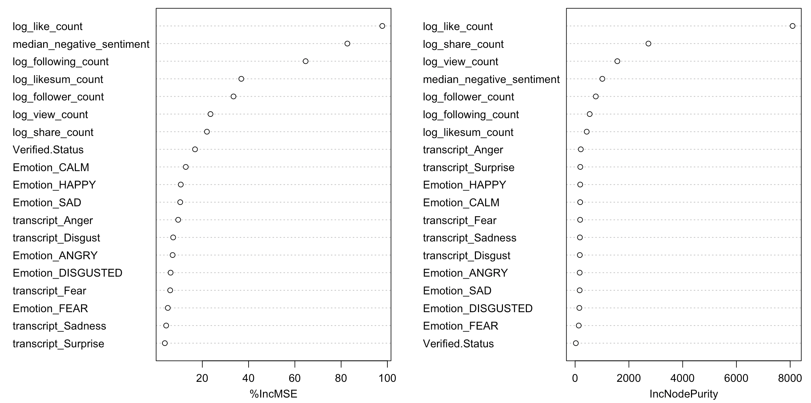
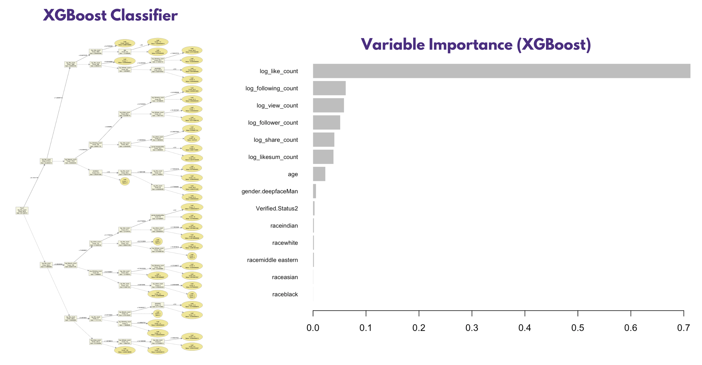

# TikTok-Viral-Videos
***Using XGBoost and Random Forest model to find the key drivers of a viral TikTok video.***

**The TikTok ecosystem is unpredictable.** While some high-quality videos receive low view counts, brief and seemingly random clips can go viral with high engagement. This project explores the **key factors that drive TikTok video virality**, focusing on facial emotion cues and transcript-based emotional tone. 

By analyzing these variables, the study aims to uncover patterns and predictors of user engagement within the TikTok’s algorithm-driven environment.




## STEP 1️⃣ LASSO Regression for Feature Selection

All variables related to facial emotion and transcript emotional tone are included in the original model. Creator profile metrics were controlled.

- Emotion(Surprised, Emotion, Fear...): Perceived facial expressions in the video
- Transcript (Anger, Disgust, Fear...): Textual tone derived from the video
- Follower & Following Count: Creator profile metrics
- Verified Status:  A flag indicating if the creator's account is officially verified by TikTok

Original Model:


```math 
\log(\text{comment\_count}) = \beta_0 + \beta_1 \log(\text{share\_count}) + \beta_2 \log(\text{view\_count}) + \beta_3 \log(\text{like\_count}) + \beta_4 \cdot \text{Emotion}_{\text{SURPRISED}} + \beta_5 \cdot \text{Emotion}_{\text{FEAR}} + \beta_6 \cdot \text{Emotion}_{\text{CONFUSED}} + \beta_7 \cdot \text{Emotion}_{\text{ANGRY}} + \beta_8 \cdot \text{Emotion}_{\text{SAD}} + \beta_9 \cdot \text{Emotion}_{\text{DISGUSTED}} + \beta_{10} \cdot \text{Emotion}_{\text{HAPPY}} + \beta_{11} \cdot \text{Emotion}_{\text{CALM}} + \beta_{12} \cdot \text{Transcript}_{\text{Anger}} + \beta_{13} \cdot \text{Transcript}_{\text{Disgust}} + \beta_{14} \cdot \text{Transcript}_{\text{Fear}} + \beta_{15} \cdot \text{Transcript}_{\text{Joy}} + \beta_{16} \cdot \text{Transcript}_{\text{Sadness}} + \beta_{17} \cdot \text{Transcript}_{\text{Surprise}} + \beta_{18} \log(\text{following\_count}) + \beta_{19} \log(\text{follower\_count}) + \beta_{20} \cdot \text{Verified} + \beta_{21} \log(\text{likesum\_count}) + u_i 
```

Some of the predictor variables exhibit high multicollinearity and have limited explanatory power for comment count. To address this issue and perform effective feature selection, a LASSO (Least Absolute Shrinkage and Selection Operator) regression is employed. 



After the LASSO regression, three variables were dropped: **Emotion Surprised, Emotion Confused, Transcript Joy**. 

The final model after LASSO Regression:

```math 
\log(\text{comment\_count}) = \beta_0 + \beta_1 \log(\text{share\_count}) + \beta_2 \log(\text{view\_count}) + \beta_3 \log(\text{like\_count}) + \beta_4 \cdot \text{Emotion}_{\text{FEAR}} + \beta_5 \cdot \text{Emotion}_{\text{ANGRY}} + \beta_6 \cdot \text{Emotion}_{\text{SAD}} + \beta_7 \cdot \text{Emotion}_{\text{DISGUSTED}} + \beta_{8} \cdot \text{Emotion}_{\text{HAPPY}} + \beta_{9} \cdot \text{Emotion}_{\text{CALM}} + \beta_{10} \cdot \text{Transcript}_{\text{Anger}} + \beta_{11} \cdot \text{Transcript}_{\text{Disgust}} + \beta_{12} \cdot \text{Transcript}_{\text{Fear}} + \beta_{13} \cdot \text{Transcript}_{\text{Sadness}} + \beta_{14} \cdot \text{Transcript}_{\text{Surprise}} + \beta_{15} \log(\text{following\_count}) + \beta_{16} \log(\text{follower\_count}) + \beta_{17} \cdot \text{Verified} + \beta_{18} \log(\text{likesum\_count}) + u_i 
```


## STEP 2️⃣ Random Forest Model

Building on the findings from the LASSO regression, we implemented a Random Forest model to further identify the most influential predictors of comment count.

The final tuned Random Forest Model explained 80.83% variance on the holdout test dataset. Below is the variable importance according to the final model.



- Median negative sentiment shows high importance and a positive coefficient: Videos with a **higher level of negative sentiment in transcripts tend to receive more comments**.

- Verified Status is also identified as an important variable, but its coefficient is negative: Videos from officially **verified accounts** are **less likely to generate a high volume of comments**.

- The emotion "Angry", detected in both facial expressions and transcripts, is positively associated with comment count: **Anger can effectively drive user engagement on TikTok**.


## STEP 3️⃣ XGBoost
In order to find out whether demographic variables will make a difference in user engagement, an XGBoost classifier is built to seperate the viral and non-viral videos.

The final tuned XGBoost Model explained 90.09% variance on the holdout test dataset. Below is the variable importance according to the final XGBoost model.



- Age is the most important demographic variable in predicting engagement. 
- The race of the creator does not affect user engagement level.

## STEP 4️⃣ Conclusion
In video transcripts, positive emotions such as joy appear to have little impact on user engagement, while negative emotions tend to drive higher comment volume. Among all emotions analyzed, anger stands out as a strong trigger for user discussion and interaction. On the other hand, creators' demographic features show limited influence on engagement metrics; however, the age of the creator does affect the virality of a video.